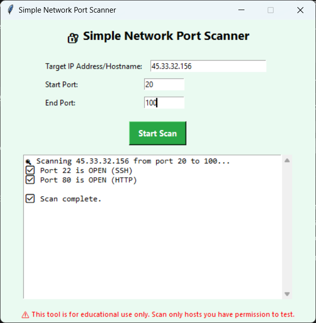

# codmetric_Simple-Network-Port-Scanner
A beginner-friendly Python-based port scanner that scans a range of ports on a given IP using sockets. Designed as part of the CodMetric Cybersecurity Internship, it helps users understand basic networking and security principles. Includes timeout handling and a user-friendly interface.

# 🔍 Simple Network Port Scanner

A beginner-friendly Python tool to scan a range of ports on a specified IP address. This project is part of the **CodMetric Cybersecurity Internship** and introduces fundamental concepts in network security.

## 🛠 Features

- Scan a user-defined range of ports on a target IP
- Identify open ports quickly using socket programming
- Built-in timeout to prevent long delays
- Console-based, user-friendly interface
- Educational and beginner-friendly code

## ⚙️ How It Works

The scanner attempts to establish a connection to each port within the range using Python’s `socket` library. If a connection is successful, the port is marked as **open**.

## 🧪 Usage
port_scanner_tool.py

Inputs:
Target IP address (e.g., 45.33.32.156)
Start port (e.g., 20)
End port (e.g., 100)

🖼️ Screenshot

📜 License
This project is licensed under the MIT License — feel free to use, modify, and share it.

🤝 Contributing
Contributions and improvements are welcome! Feel free to fork the repo and submit a pull request.

🔗 Connect
Made with ❤️ during a cybersecurity internship at CodMetric.

